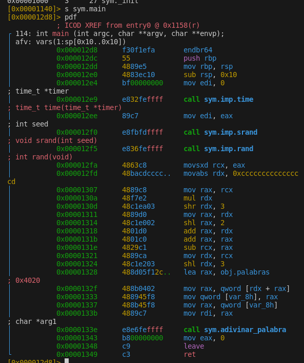

# Ejercicios de reversing

## Ejercicio 1

Compila el código fuente `hello.c` y ejecuta el programa. ¿Qué hace? ¿Qué salida produce?

Analiza el ejecutable con `objdump` y `strings`. ¿Qué instrucciones se utilizan para imprimir la cadena? ¿Qué cadenas aparecen en el ejecutable?

objdump -d hello            

hello:     file format elf64-x86-64

Disassembly of section .init:

0000000000001000 <_init>:
    1000:       48 83 ec 08             sub    $0x8,%rsp
    1004:       48 8b 05 c5 2f 00 00    mov    0x2fc5(%rip),%rax        # 3fd0 <__gmon_start__@Base>
    100b:       48 85 c0                test   %rax,%rax
    100e:       74 02                   je     1012 <_init+0x12>
    1010:       ff d0                   call   *%rax
    1012:       48 83 c4 08             add    $0x8,%rsp
    1016:       c3                      ret

Disassembly of section .plt:

0000000000001020 <puts@plt-0x10>:
    1020:       ff 35 ca 2f 00 00       push   0x2fca(%rip)        # 3ff0 <_GLOBAL_OFFSET_TABLE_+0x8>
    1026:       ff 25 cc 2f 00 00       jmp    *0x2fcc(%rip)        # 3ff8 <_GLOBAL_OFFSET_TABLE_+0x10>
    102c:       0f 1f 40 00             nopl   0x0(%rax)

0000000000001030 <puts@plt>:
    1030:       ff 25 ca 2f 00 00       jmp    *0x2fca(%rip)        # 4000 <puts@GLIBC_2.2.5>
    1036:       68 00 00 00 00          push   $0x0
    103b:       e9 e0 ff ff ff          jmp    1020 <_init+0x20>

Disassembly of section .plt.got:

0000000000001040 <__cxa_finalize@plt>:
    1040:       ff 25 9a 2f 00 00       jmp    *0x2f9a(%rip)        # 3fe0 <__cxa_finalize@GLIBC_2.2.5>
    1046:       66 90                   xchg   %ax,%ax

Disassembly of section .text:

0000000000001050 <_start>:
    1050:       31 ed                   xor    %ebp,%ebp
    1052:       49 89 d1                mov    %rdx,%r9
    1055:       5e                      pop    %rsi
    1056:       48 89 e2                mov    %rsp,%rdx
    1059:       48 83 e4 f0             and    $0xfffffffffffffff0,%rsp
    105d:       50                      push   %rax
    105e:       54                      push   %rsp
    105f:       45 31 c0                xor    %r8d,%r8d
    1062:       31 c9                   xor    %ecx,%ecx
    1064:       48 8d 3d ce 00 00 00    lea    0xce(%rip),%rdi        # 1139 <main>
    106b:       ff 15 4f 2f 00 00       call   *0x2f4f(%rip)        # 3fc0 <__libc_start_main@GLIBC_2.34>
    1071:       f4                      hlt
    1072:       66 2e 0f 1f 84 00 00    cs nopw 0x0(%rax,%rax,1)
    1079:       00 00 00 
    107c:       0f 1f 40 00             nopl   0x0(%rax)

0000000000001080 <deregister_tm_clones>:
    1080:       48 8d 3d 91 2f 00 00    lea    0x2f91(%rip),%rdi        # 4018 <__TMC_END__>
    1087:       48 8d 05 8a 2f 00 00    lea    0x2f8a(%rip),%rax        # 4018 <__TMC_END__>
    108e:       48 39 f8                cmp    %rdi,%rax
    1091:       74 15                   je     10a8 <deregister_tm_clones+0x28>
    1093:       48 8b 05 2e 2f 00 00    mov    0x2f2e(%rip),%rax        # 3fc8 <_ITM_deregisterTMCloneTable@Base>
    109a:       48 85 c0                test   %rax,%rax
    109d:       74 09                   je     10a8 <deregister_tm_clones+0x28>
    109f:       ff e0                   jmp    *%rax
    10a1:       0f 1f 80 00 00 00 00    nopl   0x0(%rax)
    10a8:       c3                      ret
    10a9:       0f 1f 80 00 00 00 00    nopl   0x0(%rax)

00000000000010b0 <register_tm_clones>:
    10b0:       48 8d 3d 61 2f 00 00    lea    0x2f61(%rip),%rdi        # 4018 <__TMC_END__>
    10b7:       48 8d 35 5a 2f 00 00    lea    0x2f5a(%rip),%rsi        # 4018 <__TMC_END__>
    10be:       48 29 fe                sub    %rdi,%rsi
    10c1:       48 89 f0                mov    %rsi,%rax
    10c4:       48 c1 ee 3f             shr    $0x3f,%rsi
    10c8:       48 c1 f8 03             sar    $0x3,%rax
    10cc:       48 01 c6                add    %rax,%rsi
    10cf:       48 d1 fe                sar    $1,%rsi
    10d2:       74 14                   je     10e8 <register_tm_clones+0x38>
    10d4:       48 8b 05 fd 2e 00 00    mov    0x2efd(%rip),%rax        # 3fd8 <_ITM_registerTMCloneTable@Base>
    10db:       48 85 c0                test   %rax,%rax
    10de:       74 08                   je     10e8 <register_tm_clones+0x38>
    10e0:       ff e0                   jmp    *%rax
    10e2:       66 0f 1f 44 00 00       nopw   0x0(%rax,%rax,1)
    10e8:       c3                      ret
    10e9:       0f 1f 80 00 00 00 00    nopl   0x0(%rax)

00000000000010f0 <__do_global_dtors_aux>:
    10f0:       f3 0f 1e fa             endbr64
    10f4:       80 3d 1d 2f 00 00 00    cmpb   $0x0,0x2f1d(%rip)        # 4018 <__TMC_END__>
    10fb:       75 2b                   jne    1128 <__do_global_dtors_aux+0x38>
    10fd:       55                      push   %rbp
    10fe:       48 83 3d da 2e 00 00    cmpq   $0x0,0x2eda(%rip)        # 3fe0 <__cxa_finalize@GLIBC_2.2.5>
    1105:       00 
    1106:       48 89 e5                mov    %rsp,%rbp
    1109:       74 0c                   je     1117 <__do_global_dtors_aux+0x27>
    110b:       48 8b 3d fe 2e 00 00    mov    0x2efe(%rip),%rdi        # 4010 <__dso_handle>
    1112:       e8 29 ff ff ff          call   1040 <__cxa_finalize@plt>
    1117:       e8 64 ff ff ff          call   1080 <deregister_tm_clones>
    111c:       c6 05 f5 2e 00 00 01    movb   $0x1,0x2ef5(%rip)        # 4018 <__TMC_END__>
    1123:       5d                      pop    %rbp
    1124:       c3                      ret
    1125:       0f 1f 00                nopl   (%rax)
    1128:       c3                      ret
    1129:       0f 1f 80 00 00 00 00    nopl   0x0(%rax)

0000000000001130 <frame_dummy>:
    1130:       f3 0f 1e fa             endbr64
    1134:       e9 77 ff ff ff          jmp    10b0 <register_tm_clones>

0000000000001139 <main>:
    1139:       55                      push   %rbp
    113a:       48 89 e5                mov    %rsp,%rbp
    113d:       48 8d 05 c0 0e 00 00    lea    0xec0(%rip),%rax        # 2004 <_IO_stdin_used+0x4>
    1144:       48 89 c7                mov    %rax,%rdi
    1147:       e8 e4 fe ff ff          call   1030 <puts@plt>
    114c:       b8 00 00 00 00          mov    $0x0,%eax
    1151:       5d                      pop    %rbp
    1152:       c3                      ret

Disassembly of section .fini:

0000000000001154 <_fini>:
    1154:       48 83 ec 08             sub    $0x8,%rsp
    1158:       48 83 c4 08             add    $0x8,%rsp
    115c:       c3                      ret

Analiza el ejecutable con radare2, obten las direcciones de las funciones usadas.

Analiza la funcion `main`, ¿que puedes obtener a partir de la misma?

push rbp El programa guarda una marca para recordar dónde empezó esta parte del código. Es como decir: "recuerda este punto para luego poder volver".

mov rbp, rsp Establece una base para trabajar con la memoria del programa. Piensa en esto como preparar un espacio de trabajo.

lea rax, [0x2004] El programa busca la frase "Hola, mundo!" que está guardada en otra parte y guarda su dirección (no la frase, solo dónde está) en el registro de 64 bits llamada rax.

mov rdi, rax Almacena el contenido del registro rax en otro registro de 64 bits rdi del cual la función llamada leerá el primer argumento.

call puts Llama a una función especial del sistema que muestra el texto en la pantalla. En este caso, va a imprimir "Hola, mundo!".

mov eax, 0 Le dice al sistema que todo ha ido bien. El 0 es como un "OK".

pop rbp Recupera la marca que guardamos al principio, para volver atrás con seguridad.

ret Termina esta parte del programa y vuelve al sistema o al que lo llamó.

## Ejercicio 2

Analiza el ejecutable `serial-check` y obtén acceso a la aplicación. 

 strings serial-check  
/lib64/ld-linux-x86-64.so.2
puts
__stack_chk_fail
__libc_start_main
__cxa_finalize
printf
__isoc99_scanf
strcmp
libc.so.6
GLIBC_2.7
GLIBC_2.4
GLIBC_2.2.5
GLIBC_2.34
_ITM_deregisterTMCloneTable
__gmon_start__
_ITM_registerTMCloneTable
PTE1
u+UH
Introduce la contrase
%19s
bombardinocrocodilo
Acceso concedido.
Acceso denegado.
9*3$"
GCC: (Ubuntu 13.3.0-6ubuntu2~24.04) 13.3.0
Scrt1.o
__abi_tag
crtstuff.c
deregister_tm_clones
__do_global_dtors_aux
completed.0
__do_global_dtors_aux_fini_array_entry
frame_dummy
__frame_dummy_init_array_entry
check_password.c
__FRAME_END__
_DYNAMIC
__GNU_EH_FRAME_HDR
_GLOBAL_OFFSET_TABLE_
__libc_start_main@GLIBC_2.34
_ITM_deregisterTMCloneTable
puts@GLIBC_2.2.5
_edata
_fini
__stack_chk_fail@GLIBC_2.4
printf@GLIBC_2.2.5
__data_start
strcmp@GLIBC_2.2.5
__gmon_start__
__dso_handle
_IO_stdin_used
_end
__bss_start
main
__isoc99_scanf@GLIBC_2.7
__TMC_END__
_ITM_registerTMCloneTable
__cxa_finalize@GLIBC_2.2.5
_init
.symtab
.strtab
.shstrtab
.interp
.note.gnu.property
.note.gnu.build-id
.note.ABI-tag
.gnu.hash
.dynsym
.dynstr
.gnu.version
.gnu.version_r
.rela.dyn
.rela.plt
.init
.plt.got
.plt.sec
.text
.fini
.rodata
.eh_frame_hdr
.eh_frame
.init_array
.fini_array
.dynamic
.data
.bss
.comment

## Ejercicio 3

Modifica el ejecutable de `serial-check` para que acepte el serial `pass1234`.

## Ejercicio 4

Analiza los ejecutables `mindreader` y `mindreader2`. ¿Eres capaz de saber cual está compilada desde C, y cual desde python? ¿Por qué?

r2 -d mindreader  
WARN: Relocs has not been applied. Please use `-e bin.relocs.apply=true` or `-e bin.cache=true` next time
[0x7f1de0810b00]> iI
arch     x86
baddr    0x55f46cd26000
binsz    14477
bintype  elf
bits     64
canary   true
injprot  false
class    ELF64
compiler GCC: (Ubuntu 13.3.0-6ubuntu2~24.04) 13.3.0
crypto   false
endian   little
havecode true
intrp    /lib64/ld-linux-x86-64.so.2
laddr    0x0
lang     c
linenum  true
lsyms    true
machine  AMD x86-64 architecture
nx       true
os       linux
pic      true
relocs   true
relro    full
rpath    NONE
sanitize false
static   false
stripped false
subsys   linux
va       true
[0x7f1de0810b00]> 

r2 -d mindreader2 
WARN: Relocs has not been applied. Please use `-e bin.relocs.apply=true` or `-e bin.cache=true` next time
[0x7f756b0aab00]> iI
arch     x86
baddr    0x400000
binsz    7439348
bintype  elf
bits     64
canary   true
injprot  false
class    ELF64
compiler GCC: (Ubuntu 7.5.0-3ubuntu1~18.04) 7.5.0
crypto   false
endian   little
havecode true
intrp    /lib64/ld-linux-x86-64.so.2
laddr    0x0
lang     c
linenum  false
lsyms    false
machine  AMD x86-64 architecture
nx       true
os       linux
pic      false
relocs   false
relro    partial
rpath    NONE
sanitize false
static   false
stripped true
subsys   linux
va       true
[0x7f756b0aab00]> 

 r2 -d mindreader2
WARN: Relocs has not been applied. Please use `-e bin.relocs.apply=true` or `-e bin.cache=true` next time
[0x7fdc9687eb00]> iz
[Strings]
nth paddr      vaddr      len size section type  string
―――――――――――――――――――――――――――――――――――――――――――――――――――――――
0   0x00008774 0x00408774 5   6    .rodata ascii 1.3.1
1   0x0000877a 0x0040877a 6   7    .rodata ascii malloc
2   0x00008784 0x00408784 5   6    .rodata ascii fseek
3   0x0000878a 0x0040878a 5   6    .rodata ascii fread
4   0x00008793 0x00408793 5   6    .rodata ascii fopen
5   0x00008799 0x00408799 6   7    .rodata ascii fwrite
6   0x000087a0 0x004087a0 23  24   .rodata ascii Failed to read cookie!\n
7   0x000087b8 0x004087b8 6   7    .rodata ascii calloc
8   0x000087bf 0x004087bf 25  26   .rodata ascii Could not read full TOC!\n
9   0x000087d9 0x004087d9 15  16   .rodata ascii Error on file.\n
10  0x000087f0 0x004087f0 64  65   .rodata ascii Failed to extract %s: inflateInit() failed with return code %d!\n
11  0x00008838 0x00408838 65  66   .rodata ascii Failed to extract %s: failed to allocate temporary input buffer!\n
12  0x00008880 0x00408880 66  67   .rodata ascii Failed to extract %s: failed to allocate temporary output buffer!\n
13  0x000088c8 0x004088c8 64  65   .rodata ascii Failed to extract %s: decompression resulted in return code %d!\n
14  0x00008910 0x00408910 51  52   .rodata ascii Failed to extract %s: failed to open archive file!\n
15  0x00008948 0x00408948 58  59   .rodata ascii Failed to extract %s: failed to seek to the entry's data!\n
16  0x00008988 0x00408988 65  66   .rodata ascii Failed to extract %s: failed to allocate data buffer (%u bytes)!\n
17  0x000089d0 0x004089d0 49  50   .rodata ascii Failed to extract %s: failed to read data chunk!\n
18  0x00008a08 0x00408a08 35  36   .rodata ascii Failed to create symbolic link %s!\n
19  0x00008a30 0x00408a30 50  51   .rodata ascii Failed to extract %s: failed to open target file!\n
20  0x00008a68 0x00408a68 59  60   .rodata ascii Failed to extract %s: failed to allocate temporary buffer!\n
21  0x00008aa8 0x00408aa8 50  51   .rodata ascii Failed to extract %s: failed to write data chunk!\n
22  0x00008ae0 0x00408ae0 35  36   .rodata ascii Failed to seek to cookie position!\n
23  0x00008b08 0x00408b08 49  50   .rodata ascii Could not allocate memory for archive structure!\n
24  0x00008b40 0x00408b40 35  36   .rodata ascii Could not allocate buffer for TOC!\n
25  0x00008b64 0x00408b64 12  13   .rodata ascii [PYI-%d:%s]
26  0x00008b71 0x00408b71 7   8    .rodata ascii WARNING
27  0x00008b79 0x00408b79 5   6    .rodata ascii ERROR
28  0x00008b7f 0x00408b7f 15  16   .rodata ascii [PYI-%d:ERROR]
29  0x00008b8f 0x00408b8f 7   8    .rodata ascii %s: %s\n
30  0x00008b97 0x00408b97 8   9    .rodata ascii __main__
31  0x00008ba0 0x00408ba0 9   10   .rodata ascii %s%c%s.py
32  0x00008baa 0x00408baa 8   9    .rodata ascii __file__
33  0x00008bb3 0x00408bb3 12  13   .rodata ascii _pyi_main_co
34  0x00008bc0 0x00408bc0 29  30   .rodata ascii Failed to extract entry: %s.\n
35  0x00008be0 0x00408be0 31  32   .rodata ascii Could not get __main__ module.\n
36  0x00008c00 0x00408c00 38  39   .rodata ascii Could not get __main__ module's dict.\n
37  0x00008c28 0x00408c28 39  40   .rodata ascii Failed to extract script from archive!\n
38  0x00008c50 0x00408c50 45  46   .rodata ascii Absolute path to script exceeds PYI_PATH_MAX\n
39  0x00008c80 0x00408c80 39  40   .rodata ascii Failed to unmarshal code object for %s\n
40  0x00008ca8 0x00408ca8 58  59   .rodata ascii Failed to execute script '%s' due to unhandled exception!\n
41  0x00008ce8 0x00408ce8 52  53   .rodata ascii Extraction path length exceeds maximum path length!\n
42  0x00008d20 0x00408d20 39  40   .rodata ascii File already exists but should not: %s\n
43  0x00008d48 0x00408d48 45  46   .rodata ascii Failed to create parent directory structure.\n
44  0x00008d78 0x00408d78 41  42   .rodata ascii Failed to remove temporary directory: %s\n
45  0x00008da8 0x00408da8 75  76   .rodata ascii Could not load PyInstaller's embedded PKG archive from the executable (%s)\n
46  0x00008df8 0x00408df8 70  71   .rodata ascii Could not side-load PyInstaller's PKG archive from external file (%s)\n
47  0x00008e40 0x00408e40 47  48   .rodata ascii Invalid value in _PYI_PARENT_PROCESS_LEVEL: %s\n
48  0x00008e70 0x00408e70 30  31   .rodata ascii PYINSTALLER_STRICT_UNPACK_MODE
49  0x00008e90 0x00408e90 38  39   .rodata ascii Could not create temporary directory!\n
50  0x00008eb8 0x00408eb8 61  62   .rodata ascii _PYI_APPLICATION_HOME_DIR not set for onefile child process!\n
51  0x00008ef8 0x00408ef8 33  34   .rodata ascii Path exceeds PYI_PATH_MAX limit.\n
52  0x00008f20 0x00408f20 50  51   .rodata ascii LOADER: failed to allocate argv array for execvp!\n
53  0x00008f58 0x00408f58 38  39   .rodata ascii LOADER: failed to restart process: %s\n
54  0x00008f80 0x00408f80 34  35   .rodata ascii PYINSTALLER_SUPPRESS_SPLASH_SCREEN
55  0x00008fa8 0x00408fa8 40  41   .rodata ascii Failed to load splash screen resources!\n
56  0x00008fd8 0x00408fd8 62  63   .rodata ascii Failed to unpack splash screen dependencies from PKG archive!\n
57  0x00009018 0x00409018 58  59   .rodata ascii Failed to load Tcl/Tk shared libraries for splash screen!\n
58  0x00009058 0x00409058 31  32   .rodata ascii Failed to start splash screen!\n
59  0x0000907a 0x0040907a 14  15   .rodata ascii /proc/self/exe
60  0x00009089 0x00409089 16  17   .rodata ascii ld-%64[^.].so.%d
61  0x0000909c 0x0040909c 29  30   .rodata ascii PYINSTALLER_RESET_ENVIRONMENT
62  0x000090ba 0x004090ba 17  18   .rodata ascii _PYI_ARCHIVE_FILE
63  0x000090cc 0x004090cc 25  26   .rodata ascii _PYI_APPLICATION_HOME_DIR
64  0x000090e6 0x004090e6 25  26   .rodata ascii _PYI_PARENT_PROCESS_LEVEL
65  0x00009100 0x00409100 15  16   .rodata ascii _PYI_SPLASH_IPC
66  0x00009110 0x00409110 23  24   .rodata ascii _PYI_LINUX_PROCESS_NAME
67  0x00009128 0x00409128 15  16   .rodata ascii pyi-python-flag
68  0x00009138 0x00409138 15  16   .rodata ascii Py_GIL_DISABLED
69  0x00009148 0x00409148 18  19   .rodata ascii pyi-runtime-tmpdir
70  0x0000915b 0x0040915b 22  23   .rodata ascii pyi-contents-directory
71  0x00009172 0x00409172 29  30   .rodata ascii pyi-bootloader-ignore-signals
72  0x00009190 0x00409190 14  15   .rodata ascii %s%c%s%c%s%c%s
73  0x0000919f 0x0040919f 10  11   .rodata ascii %s%c%s.pkg
74  0x000091aa 0x004091aa 10  11   .rodata ascii %s%c%s.exe
75  0x000091b5 0x004091b5 27  28   .rodata ascii Failed to open archive %s!\n
76  0x000091d8 0x004091d8 32  33   .rodata ascii Failed to copy file %s from %s!\n
77  0x00009200 0x00409200 44  45   .rodata ascii Referenced dependency archive %s not found.\n
78  0x00009230 0x00409230 34  35   .rodata ascii Maximum archive pool size reached!
79  0x00009258 0x00409258 49  50   .rodata ascii Failed to open referenced dependency archive %s.\n
80  0x00009290 0x00409290 62  63   .rodata ascii Dependency %s not found in the referenced dependency archive.\n
81  0x000092d0 0x004092d0 60  61   .rodata ascii Failed to extract %s from referenced dependency archive %s.\n
82  0x0000930d 0x0040930d 4   5    .rodata ascii pyi-
83  0x00009312 0x00409312 7   8    .rodata ascii verbose
84  0x0000931a 0x0040931a 10  11   .rodata ascii unbuffered
85  0x00009327 0x00409327 8   9    .rodata ascii optimize
86  0x00009336 0x00409336 9   10   .rodata ascii hash_seed
87  0x00009340 0x00409340 4   5    .rodata ascii utf8
88  0x00009349 0x00409349 16  17   .rodata ascii base_library.zip
89  0x0000935a 0x0040935a 11  12   .rodata ascii lib-dynload
90  0x000094b8 0x004094b8 9   10   .rodata ascii Py_DecRef
91  0x000094c2 0x004094c2 27  28   .rodata ascii Cannot dlsym for Py_DecRef\n
92  0x000094de 0x004094de 15  16   .rodata ascii Py_DecodeLocale
93  0x000094ee 0x004094ee 22  23   .rodata ascii Py_ExitStatusException
94  0x00009505 0x00409505 11  12   .rodata ascii Py_Finalize
95  0x00009511 0x00409511 29  30   .rodata ascii Cannot dlsym for Py_Finalize\n
96  0x0000952f 0x0040952f 23  24   .rodata ascii Py_InitializeFromConfig
97  0x00009547 0x00409547 16  17   .rodata ascii Py_IsInitialized
98  0x00009558 0x00409558 16  17   .rodata ascii Py_PreInitialize
99  0x00009569 0x00409569 14  15   .rodata ascii PyConfig_Clear
100 0x00009578 0x00409578 27  28   .rodata ascii PyConfig_InitIsolatedConfig
101 0x00009594 0x00409594 13  14   .rodata ascii PyConfig_Read
102 0x000095a2 0x004095a2 23  24   .rodata ascii PyConfig_SetBytesString
103 0x000095ba 0x004095ba 18  19   .rodata ascii PyConfig_SetString
104 0x000095cd 0x004095cd 26  27   .rodata ascii PyConfig_SetWideStringList
105 0x000095e8 0x004095e8 11  12   .rodata ascii PyErr_Clear
106 0x000095f4 0x004095f4 29  30   .rodata ascii Cannot dlsym for PyErr_Clear\n
107 0x00009612 0x00409612 11  12   .rodata ascii PyErr_Fetch
108 0x0000961e 0x0040961e 29  30   .rodata ascii Cannot dlsym for PyErr_Fetch\n
109 0x0000963c 0x0040963c 24  25   .rodata ascii PyErr_NormalizeException
110 0x00009655 0x00409655 14  15   .rodata ascii PyErr_Occurred
111 0x00009664 0x00409664 11  12   .rodata ascii PyErr_Print
112 0x00009670 0x00409670 29  30   .rodata ascii Cannot dlsym for PyErr_Print\n
113 0x0000968e 0x0040968e 13  14   .rodata ascii PyErr_Restore
114 0x0000969c 0x0040969c 15  16   .rodata ascii PyEval_EvalCode
115 0x000096ac 0x004096ac 18  19   .rodata ascii PyImport_AddModule
116 0x000096bf 0x004096bf 23  24   .rodata ascii PyImport_ExecCodeModule
117 0x000096d7 0x004096d7 21  22   .rodata ascii PyImport_ImportModule
118 0x000096ed 0x004096ed 13  14   .rodata ascii PyMem_RawFree
119 0x000096fb 0x004096fb 16  17   .rodata ascii PyModule_GetDict
120 0x0000970c 0x0040970c 21  22   .rodata ascii PyObject_CallFunction
121 0x00009722 0x00409722 28  29   .rodata ascii PyObject_CallFunctionObjArgs
122 0x0000973f 0x0040973f 22  23   .rodata ascii PyObject_GetAttrString
123 0x00009756 0x00409756 22  23   .rodata ascii PyObject_SetAttrString
124 0x0000976d 0x0040976d 12  13   .rodata ascii PyObject_Str
125 0x0000977a 0x0040977a 23  24   .rodata ascii PyRun_SimpleStringFlags
126 0x00009792 0x00409792 18  19   .rodata ascii PyStatus_Exception
127 0x000097a5 0x004097a5 15  16   .rodata ascii PySys_GetObject
128 0x000097b5 0x004097b5 15  16   .rodata ascii PySys_SetObject
129 0x000097c5 0x004097c5 16  17   .rodata ascii PyUnicode_AsUTF8
130 0x000097d6 0x004097d6 16  17   .rodata ascii PyUnicode_Decode
131 0x000097e7 0x004097e7 25  26   .rodata ascii PyUnicode_DecodeFSDefault
132 0x00009801 0x00409801 20  21   .rodata ascii PyUnicode_FromFormat
133 0x00009816 0x00409816 20  21   .rodata ascii PyUnicode_FromString
134 0x0000982b 0x0040982b 14  15   .rodata ascii PyUnicode_Join
135 0x0000983a 0x0040983a 17  18   .rodata ascii PyUnicode_Replace
136 0x00009850 0x00409850 33  34   .rodata ascii Cannot dlsym for Py_DecodeLocale\n
137 0x00009878 0x00409878 40  41   .rodata ascii Cannot dlsym for Py_ExitStatusException\n
138 0x000098a8 0x004098a8 41  42   .rodata ascii Cannot dlsym for Py_InitializeFromConfig\n
139 0x000098d8 0x004098d8 34  35   .rodata ascii Cannot dlsym for Py_IsInitialized\n
140 0x00009900 0x00409900 34  35   .rodata ascii Cannot dlsym for Py_PreInitialize\n
141 0x00009928 0x00409928 32  33   .rodata ascii Cannot dlsym for PyConfig_Clear\n
142 0x00009950 0x00409950 45  46   .rodata ascii Cannot dlsym for PyConfig_InitIsolatedConfig\n
143 0x00009980 0x00409980 31  32   .rodata ascii Cannot dlsym for PyConfig_Read\n
144 0x000099a0 0x004099a0 41  42   .rodata ascii Cannot dlsym for PyConfig_SetBytesString\n
145 0x000099d0 0x004099d0 36  37   .rodata ascii Cannot dlsym for PyConfig_SetString\n
146 0x000099f8 0x004099f8 44  45   .rodata ascii Cannot dlsym for PyConfig_SetWideStringList\n
147 0x00009a28 0x00409a28 42  43   .rodata ascii Cannot dlsym for PyErr_NormalizeException\n
148 0x00009a58 0x00409a58 32  33   .rodata ascii Cannot dlsym for PyErr_Occurred\n
149 0x00009a80 0x00409a80 31  32   .rodata ascii Cannot dlsym for PyErr_Restore\n
150 0x00009aa0 0x00409aa0 33  34   .rodata ascii Cannot dlsym for PyEval_EvalCode\n
151 0x00009ac8 0x00409ac8 36  37   .rodata ascii Cannot dlsym for PyImport_AddModule\n
152 0x00009af0 0x00409af0 41  42   .rodata ascii Cannot dlsym for PyImport_ExecCodeModule\n
153 0x00009b20 0x00409b20 39  40   .rodata ascii Cannot dlsym for PyImport_ImportModule\n
154 0x00009b48 0x00409b48 30  31   .rodata ascii PyMarshal_ReadObjectFromString
155 0x00009b68 0x00409b68 48  49   .rodata ascii Cannot dlsym for PyMarshal_ReadObjectFromString\n
156 0x00009ba0 0x00409ba0 31  32   .rodata ascii Cannot dlsym for PyMem_RawFree\n
157 0x00009bc0 0x00409bc0 34  35   .rodata ascii Cannot dlsym for PyModule_GetDict\n
158 0x00009be8 0x00409be8 39  40   .rodata ascii Cannot dlsym for PyObject_CallFunction\n
159 0x00009c10 0x00409c10 46  47   .rodata ascii Cannot dlsym for PyObject_CallFunctionObjArgs\n
160 0x00009c40 0x00409c40 40  41   .rodata ascii Cannot dlsym for PyObject_GetAttrString\n
161 0x00009c70 0x00409c70 40  41   .rodata ascii Cannot dlsym for PyObject_SetAttrString\n
162 0x00009ca0 0x00409ca0 30  31   .rodata ascii Cannot dlsym for PyObject_Str\n
163 0x00009cc0 0x00409cc0 30  31   .rodata ascii PyPreConfig_InitIsolatedConfig
164 0x00009ce0 0x00409ce0 48  49   .rodata ascii Cannot dlsym for PyPreConfig_InitIsolatedConfig\n
165 0x00009d18 0x00409d18 41  42   .rodata ascii Cannot dlsym for PyRun_SimpleStringFlags\n
166 0x00009d48 0x00409d48 36  37   .rodata ascii Cannot dlsym for PyStatus_Exception\n
167 0x00009d70 0x00409d70 33  34   .rodata ascii Cannot dlsym for PySys_GetObject\n
168 0x00009d98 0x00409d98 33  34   .rodata ascii Cannot dlsym for PySys_SetObject\n
169 0x00009dc0 0x00409dc0 34  35   .rodata ascii Cannot dlsym for PyUnicode_AsUTF8\n
170 0x00009de8 0x00409de8 34  35   .rodata ascii Cannot dlsym for PyUnicode_Decode\n
171 0x00009e10 0x00409e10 43  44   .rodata ascii Cannot dlsym for PyUnicode_DecodeFSDefault\n
172 0x00009e40 0x00409e40 38  39   .rodata ascii Cannot dlsym for PyUnicode_FromFormat\n
173 0x00009e68 0x00409e68 38  39   .rodata ascii Cannot dlsym for PyUnicode_FromString\n
174 0x00009e90 0x00409e90 32  33   .rodata ascii Cannot dlsym for PyUnicode_Join\n
175 0x00009eb8 0x00409eb8 35  36   .rodata ascii Cannot dlsym for PyUnicode_Replace\n
176 0x00009edc 0x00409edc 28  29   .rodata ascii Failed to set program name!\n
177 0x00009ef9 0x00409ef9 24  25   .rodata ascii Failed to set sys.argv!\n
178 0x00009f12 0x00409f12 8   9    .rodata ascii _MEIPASS
179 0x00009f1b 0x00409f1b 16  17   .rodata ascii _pyinstaller_pyz
180 0x00009f2c 0x00409f2c 7   8    .rodata ascii %U?%llu
181 0x00009f38 0x00409f38 77  78   .rodata ascii Path of Python shared library (%s) and its name (%s) exceed buffer size (%d)\n
182 0x00009f88 0x00409f88 54  55   .rodata ascii Failed to load Python shared library '%s': dlopen: %s\n
183 0x00009fc0 0x00409fc0 34  35   .rodata ascii Failed to parse run-time options!\n
184 0x00009fe8 0x00409fe8 54  55   .rodata ascii Failed to pre-initialize embedded python interpreter!\n
185 0x0000a020 0x0040a020 67  68   .rodata ascii Failed to allocate PyConfig structure! Unsupported python version?\n
186 0x0000a068 0x0040a068 32  33   .rodata ascii Failed to set python home path!\n
187 0x0000a090 0x0040a090 35  36   .rodata ascii Failed to set module search paths!\n
188 0x0000a0b8 0x0040a0b8 32  33   .rodata ascii Failed to set run-time options!\n
189 0x0000a0e0 0x0040a0e0 45  46   .rodata ascii Failed to start embedded python interpreter!\n
190 0x0000a110 0x0040a110 36  37   .rodata ascii Failed to get _MEIPASS as PyObject.\n
191 0x0000a138 0x0040a138 47  48   .rodata ascii Failed to unmarshal code object for module %s!\n
192 0x0000a168 0x0040a168 30  31   .rodata ascii Module object for %s is NULL!\n
193 0x0000a188 0x0040a188 40  41   .rodata ascii PYZ archive entry not found in the TOC!\n
194 0x0000a1b8 0x0040a1b8 45  46   .rodata ascii Failed to format PYZ archive path and offset\n
195 0x0000a1e8 0x0040a1e8 49  50   .rodata ascii Failed to store path to PYZ archive into sys.%s!\n
196 0x0000a220 0x0040a220 128 129  .rodata ascii import sys; sys.stdout.flush();         (sys.__stdout__.flush if sys.__stdout__         is not sys.stdout else (lambda: None))()
197 0x0000a2a8 0x0040a2a8 128 129  .rodata ascii import sys; sys.stderr.flush();         (sys.__stderr__.flush if sys.__stderr__         is not sys.stderr else (lambda: None))()
198 0x0000a329 0x0040a329 11  12   .rodata ascii status_text
199 0x0000a335 0x0040a335 7   8    .rodata ascii tclInit
200 0x0000a33d 0x0040a33d 15  16   .rodata ascii tcl_findLibrary
201 0x0000a34d 0x0040a34d 4   5    .rodata ascii exit
202 0x0000a352 0x0040a352 25  26   .rodata ascii rename ::source ::_source
203 0x0000a36c 0x0040a36c 11  12   .rodata ascii _image_data
204 0x0000a378 0x0040a378 6   7    .rodata ascii tk.tcl
205 0x0000a37f 0x0040a37f 10  11   .rodata ascii tk_library
206 0x0000a390 0x0040a390 71  72   .rodata ascii SPLASH: length of Tcl shared library path exceeds maximum path length!\n
207 0x0000a3d8 0x0040a3d8 70  71   .rodata ascii SPLASH: length of Tk shared library path exceeds maximum path length!\n
208 0x0000a420 0x0040a420 55  56   .rodata ascii Could not allocate memory for splash screen resources.\n
209 0x0000a458 0x0040a458 50  51   .rodata ascii SPLASH: could not find requirement %s in archive.\n
210 0x0000a490 0x0040a490 60  61   .rodata ascii SPLASH: extraction path length exceeds maximum path length!\n
211 0x0000a4d0 0x0040a4d0 47  48   .rodata ascii SPLASH: file already exists but should not: %s\n
212 0x0000a500 0x0040a500 53  54   .rodata ascii SPLASH: failed to create parent directory structure.\n
213 0x0000a538 0x0040a538 42  43   .rodata ascii SPLASH: could not extract requirement %s.\n
214 0x0000a568 0x0040a568 48  49   .rodata ascii SPLASH: failed to load Tcl/Tk shared libraries!\n
215 0x0000a5a0 0x0040a5a0 46  47   .rodata ascii Could not allocate memory for SPLASH_CONTEXT.\n
216 0x0000a5d0 0x0040a5d0 61  62   .rodata ascii SPLASH: Tcl is not threaded. Only threaded Tcl is supported.\n
217 0x0000a60e 0x0040a60e 8   9    .rodata ascii Tcl_Init
218 0x0000a617 0x0040a617 26  27   .rodata ascii Cannot dlsym for Tcl_Init\n
219 0x0000a632 0x0040a632 16  17   .rodata ascii Tcl_CreateInterp
220 0x0000a643 0x0040a643 18  19   .rodata ascii Tcl_FindExecutable
221 0x0000a656 0x0040a656 14  15   .rodata ascii Tcl_DoOneEvent
222 0x0000a665 0x0040a665 12  13   .rodata ascii Tcl_Finalize
223 0x0000a672 0x0040a672 18  19   .rodata ascii Tcl_FinalizeThread
224 0x0000a685 0x0040a685 16  17   .rodata ascii Tcl_DeleteInterp
225 0x0000a696 0x0040a696 16  17   .rodata ascii Tcl_CreateThread
226 0x0000a6a7 0x0040a6a7 20  21   .rodata ascii Tcl_GetCurrentThread
227 0x0000a6bc 0x0040a6bc 14  15   .rodata ascii Tcl_JoinThread
228 0x0000a6cb 0x0040a6cb 13  14   .rodata ascii Tcl_MutexLock
229 0x0000a6d9 0x0040a6d9 15  16   .rodata ascii Tcl_MutexUnlock
230 0x0000a6e9 0x0040a6e9 17  18   .rodata ascii Tcl_MutexFinalize
231 0x0000a6fb 0x0040a6fb 21  22   .rodata ascii Tcl_ConditionFinalize
232 0x0000a711 0x0040a711 19  20   .rodata ascii Tcl_ConditionNotify
233 0x0000a725 0x0040a725 17  18   .rodata ascii Tcl_ConditionWait
234 0x0000a737 0x0040a737 20  21   .rodata ascii Tcl_ThreadQueueEvent
235 0x0000a74c 0x0040a74c 15  16   .rodata ascii Tcl_ThreadAlert
236 0x0000a75c 0x0040a75c 11  12   .rodata ascii Tcl_GetVar2
237 0x0000a768 0x0040a768 29  30   .rodata ascii Cannot dlsym for Tcl_GetVar2\n
238 0x0000a786 0x0040a786 11  12   .rodata ascii Tcl_SetVar2
239 0x0000a792 0x0040a792 29  30   .rodata ascii Cannot dlsym for Tcl_SetVar2\n
240 0x0000a7b0 0x0040a7b0 20  21   .rodata ascii Tcl_CreateObjCommand
241 0x0000a7c5 0x0040a7c5 13  14   .rodata ascii Tcl_GetString
242 0x0000a7d3 0x0040a7d3 16  17   .rodata ascii Tcl_NewStringObj
243 0x0000a7e4 0x0040a7e4 19  20   .rodata ascii Tcl_NewByteArrayObj
244 0x0000a7f8 0x0040a7f8 13  14   .rodata ascii Tcl_SetVar2Ex
245 0x0000a806 0x0040a806 16  17   .rodata ascii Tcl_GetObjResult
246 0x0000a817 0x0040a817 12  13   .rodata ascii Tcl_EvalFile
247 0x0000a824 0x0040a824 10  11   .rodata ascii Tcl_EvalEx
248 0x0000a82f 0x0040a82f 28  29   .rodata ascii Cannot dlsym for Tcl_EvalEx\n
249 0x0000a84c 0x0040a84c 12  13   .rodata ascii Tcl_EvalObjv
250 0x0000a859 0x0040a859 9   10   .rodata ascii Tcl_Alloc
251 0x0000a863 0x0040a863 27  28   .rodata ascii Cannot dlsym for Tcl_Alloc\n
252 0x0000a87f 0x0040a87f 8   9    .rodata ascii Tcl_Free
253 0x0000a888 0x0040a888 26  27   .rodata ascii Cannot dlsym for Tcl_Free\n
254 0x0000a8a3 0x0040a8a3 7   8    .rodata ascii Tk_Init
255 0x0000a8ab 0x0040a8ab 25  26   .rodata ascii Cannot dlsym for Tk_Init\n
256 0x0000a8c5 0x0040a8c5 20  21   .rodata ascii Tk_GetNumMainWindows
257 0x0000a8e0 0x0040a8e0 34  35   .rodata ascii Cannot dlsym for Tcl_CreateInterp\n
258 0x0000a908 0x0040a908 36  37   .rodata ascii Cannot dlsym for Tcl_FindExecutable\n
259 0x0000a930 0x0040a930 32  33   .rodata ascii Cannot dlsym for Tcl_DoOneEvent\n
260 0x0000a958 0x0040a958 30  31   .rodata ascii Cannot dlsym for Tcl_Finalize\n
261 0x0000a978 0x0040a978 36  37   .rodata ascii Cannot dlsym for Tcl_FinalizeThread\n
262 0x0000a9a0 0x0040a9a0 34  35   .rodata ascii Cannot dlsym for Tcl_DeleteInterp\n
263 0x0000a9c8 0x0040a9c8 34  35   .rodata ascii Cannot dlsym for Tcl_CreateThread\n
264 0x0000a9f0 0x0040a9f0 38  39   .rodata ascii Cannot dlsym for Tcl_GetCurrentThread\n
265 0x0000aa18 0x0040aa18 32  33   .rodata ascii Cannot dlsym for Tcl_JoinThread\n
266 0x0000aa40 0x0040aa40 31  32   .rodata ascii Cannot dlsym for Tcl_MutexLock\n
267 0x0000aa60 0x0040aa60 33  34   .rodata ascii Cannot dlsym for Tcl_MutexUnlock\n
268 0x0000aa88 0x0040aa88 35  36   .rodata ascii Cannot dlsym for Tcl_MutexFinalize\n
269 0x0000aab0 0x0040aab0 39  40   .rodata ascii Cannot dlsym for Tcl_ConditionFinalize\n
270 0x0000aad8 0x0040aad8 37  38   .rodata ascii Cannot dlsym for Tcl_ConditionNotify\n
271 0x0000ab00 0x0040ab00 35  36   .rodata ascii Cannot dlsym for Tcl_ConditionWait\n
272 0x0000ab28 0x0040ab28 38  39   .rodata ascii Cannot dlsym for Tcl_ThreadQueueEvent\n
273 0x0000ab50 0x0040ab50 33  34   .rodata ascii Cannot dlsym for Tcl_ThreadAlert\n
274 0x0000ab78 0x0040ab78 38  39   .rodata ascii Cannot dlsym for Tcl_CreateObjCommand\n
275 0x0000aba0 0x0040aba0 31  32   .rodata ascii Cannot dlsym for Tcl_GetString\n
276 0x0000abc0 0x0040abc0 34  35   .rodata ascii Cannot dlsym for Tcl_NewStringObj\n
277 0x0000abe8 0x0040abe8 37  38   .rodata ascii Cannot dlsym for Tcl_NewByteArrayObj\n
278 0x0000ac10 0x0040ac10 31  32   .rodata ascii Cannot dlsym for Tcl_SetVar2Ex\n
279 0x0000ac30 0x0040ac30 34  35   .rodata ascii Cannot dlsym for Tcl_GetObjResult\n
280 0x0000ac58 0x0040ac58 30  31   .rodata ascii Cannot dlsym for Tcl_EvalFile\n
281 0x0000ac78 0x0040ac78 30  31   .rodata ascii Cannot dlsym for Tcl_EvalObjv\n
282 0x0000ac98 0x0040ac98 38  39   .rodata ascii Cannot dlsym for Tk_GetNumMainWindows\n
283 0x0000acbf 0x0040acbf 4   5    .rodata ascii %s%c
284 0x0000acc4 0x0040acc4 4   5    .rodata ascii %.*s
285 0x0000acd8 0x0040acd8 62  63   .rodata ascii LOADER: length of runtime-tmpdir exceeds maximum path length!\n
286 0x0000ad18 0x0040ad18 63  64   .rodata ascii Failed to create or resolve runtime_tmpdir from given path: %s\n
287 0x0000ad58 0x0040ad58 63  64   .rodata ascii Length of resolved runtime_tmpdir exceeds maximum path length!\n
288 0x0000ad98 0x0040ad98 40  41   .rodata ascii LOADER: failed to allocate pyi_argv: %s\n
289 0x0000adc8 0x0040adc8 38  39   .rodata ascii LOADER: failed to strdup argv[%d]: %s\n
290 0x0000adf0 0x0040adf0 37  38   .rodata ascii Failed to initialize sync semaphore!\n
291 0x0000ae18 0x0040ae18 53  54   .rodata ascii LOADER: failed to destroy sync semaphore (errno %d)!\n
292 0x0000ae50 0x0040ae50 34  35   .rodata ascii Failed to wait on sync semaphore!\n
293 0x0000ae78 0x0040ae78 93  94   .rodata ascii LOADER: application is started by systemd socket, but we cannot set proper LISTEN_PID on it.\n
294 0x0000aed8 0x0040aed8 42  43   .rodata ascii LOADER: failed to start child process: %s\n
295 0x0000af08 0x0040af08 39  40   .rodata ascii LOADER: failed start child process: %s\n
296 0x0000af30 0x0040af30 37  38   .rodata ascii Failed to signal the sync semaphore!\n
297 0x0000af58 0x0040af58 45  46   .rodata ascii LOADER: failed to wait for child process: %s\n
298 0x0000af88 0x0040af88 41  42   .rodata ascii LOADER: failed to fork child process: %s\n
299 0x0000afb8 0x0040afb8 6   7    .rodata ascii TMPDIR
300 0x0000afc2 0x0040afc2 15  16   .rodata ascii LD_LIBRARY_PATH
301 0x0000afd2 0x0040afd2 20  21   .rodata ascii LD_LIBRARY_PATH_ORIG
302 0x0000afe7 0x0040afe7 5   6    .rodata ascii %s:%s
303 0x0000afed 0x0040afed 6   7    .rodata ascii semctl
304 0x0000aff4 0x0040aff4 5   6    .rodata ascii semop
305 0x0000affa 0x0040affa 10  11   .rodata ascii LISTEN_PID
306 0x0000b009 0x0040b009 8   9    .rodata ascii /var/tmp
307 0x0000b012 0x0040b012 8   9    .rodata ascii /usr/tmp
308 0x0000b01b 0x0040b01b 4   5    .rodata ascii TEMP
[0x7fdc9687eb00]> 

r2 -d mindreader2
WARN: Relocs has not been applied. Please use `-e bin.relocs.apply=true` or `-e bin.cache=true` next time
[0x7f7b9496ab00]> iz~py
31  0x00008ba0 0x00408ba0 9   10   .rodata ascii %s%c%s.py
33  0x00008bb3 0x00408bb3 12  13   .rodata ascii _pyi_main_co
67  0x00009128 0x00409128 15  16   .rodata ascii pyi-python-flag
69  0x00009148 0x00409148 18  19   .rodata ascii pyi-runtime-tmpdir
70  0x0000915b 0x0040915b 22  23   .rodata ascii pyi-contents-directory
71  0x00009172 0x00409172 29  30   .rodata ascii pyi-bootloader-ignore-signals
76  0x000091d8 0x004091d8 32  33   .rodata ascii Failed to copy file %s from %s!\n
82  0x0000930d 0x0040930d 4   5    .rodata ascii pyi-
179 0x00009f1b 0x00409f1b 16  17   .rodata ascii _pyinstaller_pyz
184 0x00009fe8 0x00409fe8 54  55   .rodata ascii Failed to pre-initialize embedded python interpreter!\n
185 0x0000a020 0x0040a020 67  68   .rodata ascii Failed to allocate PyConfig structure! Unsupported python version?\n
186 0x0000a068 0x0040a068 32  33   .rodata ascii Failed to set python home path!\n
189 0x0000a0e0 0x0040a0e0 45  46   .rodata ascii Failed to start embedded python interpreter!\n
288 0x0000ad98 0x0040ad98 40  41   .rodata ascii LOADER: failed to allocate pyi_argv: %s\n
[0x7f7b9496ab00]> 

### Conclusión

El ejecutable **mindreader** muestra indicios claros de haber sido compilado desde lenguaje C. Sus cadenas son breves, legibles y tienen sentido inmediato, como nombres de frutas o frases simples, lo cual es típico de programas escritos en C.

En cambio, **mindreader2**, aunque también se presenta como un binario, proviene de un script en **Python** y ha sido convertido a ejecutable utilizando **PyInstaller**. Esto se puede identificar porque el archivo contiene numerosas referencias internas relacionadas con Python, como cadenas que incluyen prefijos `pyi-`, rutas o variables del intérprete, y mensajes que son característicos del entorno de ejecución de Python embebido.

Otra pista clara es el tamaño: mientras que mindreader es un binario muy ligero (alrededor de 14 KB), mindreader2 supera los **7 MB**, lo que deja ver que dentro lleva incluido todo el entorno necesario para ejecutar el script Python original.

## Ejercicio 5

Ambos ejecutables tienen una flag, intenta hacer que el programa te de la flag. **NO** sirve encontrar la flag como un string, debes provocar que el ejecutable lo devuelva en tiempo de ejecución.

r2 mindreader    
WARN: Relocs has not been applied. Please use `-e bin.relocs.apply=true` or `-e bin.cache=true` next time
[0x00001140]> aaa
INFO: Analyze all flags starting with sym. and entry0 (aa)
INFO: Analyze imports (af@@@i)
INFO: Analyze entrypoint (af@ entry0)
INFO: Analyze symbols (af@@@s)
INFO: Analyze all functions arguments/locals (afva@@@F)
INFO: Analyze function calls (aac)
INFO: Analyze len bytes of instructions for references (aar)
INFO: Finding and parsing C++ vtables (avrr)
INFO: Analyzing methods (af @@ method.*)
INFO: Recovering local variables (afva@@@F)
INFO: Type matching analysis for all functions (aaft)
INFO: Propagate noreturn information (aanr)
INFO: Use -AA or aaaa to perform additional experimental analysis
[0x00001140]> afl
0x000010c0    1     10 sym.imp.puts
0x000010d0    1     10 sym.imp.__stack_chk_fail
0x000010e0    1     10 sym.imp.strcspn
0x000010f0    1     10 sym.imp.srand
0x00001100    1     10 sym.imp.fgets
0x00001110    1     10 sym.imp.strcmp
0x00001120    1     10 sym.imp.time
0x00001130    1     10 sym.imp.rand
0x00001140    1     37 entry0
0x00001170    4     34 sym.deregister_tm_clones
0x000011a0    4     51 sym.register_tm_clones
0x000011e0    5     54 entry.fini0
0x000010b0    1     10 fcn.000010b0
0x00001220    1      9 entry.init0
0x0000134c    1     13 sym._fini
0x000012d8    1    114 main
0x00001229    6    175 sym.adivinar_palabra
0x00001000    3     27 sym._init
[0x00001140]> 

Accedemos a la función sym.main y a imprimirla para observar su comportamiento

Llama a time(0) y a srand(): estas funciones se utilizan para iniciar el generador de números aleatorios usando la hora del sistema como semilla.

Luego genera un número aleatorio mediante rand(), al que se le aplican algunas operaciones matemáticas para determinar el índice de una palabra dentro del array obj.palabras.

Esa palabra se carga y se guarda en la dirección rbp-0x8.

Después se invoca a la función sym.adivinar_palabra(char *palabra), pasando como argumento la palabra previamente seleccionada.

Finalmente, el programa finaliza su ejecución.

Ahora comprobamos la función adivinar_palabra

[0x00001140]> s sym.main
[0x000012d8]> pdf
            ; ICOD XREF from entry0 @ 0x1158(r)
┌ 114: int main (int argc, char **argv, char **envp);
│ afv: vars(1:sp[0x10..0x10])
│           0x000012d8      f30f1efa       endbr64
│           0x000012dc      55             push rbp
│           0x000012dd      4889e5         mov rbp, rsp
│           0x000012e0      4883ec10       sub rsp, 0x10
│           0x000012e4      bf00000000     mov edi, 0                  ; time_t *timer
│           0x000012e9      e832feffff     call sym.imp.time           ; time_t time(time_t *timer)
│           0x000012ee      89c7           mov edi, eax                ; int seed
│           0x000012f0      e8fbfdffff     call sym.imp.srand          ; void srand(int seed)
│           0x000012f5      e836feffff     call sym.imp.rand           ; int rand(void)
│           0x000012fa      4863c8         movsxd rcx, eax
│           0x000012fd      48bacdcccc..   movabs rdx, 0xcccccccccccccccd
│           0x00001307      4889c8         mov rax, rcx
│           0x0000130a      48f7e2         mul rdx
│           0x0000130d      48c1ea03       shr rdx, 3
│           0x00001311      4889d0         mov rax, rdx
│           0x00001314      48c1e002       shl rax, 2
│           0x00001318      4801d0         add rax, rdx
│           0x0000131b      4801c0         add rax, rax
│           0x0000131e      4829c1         sub rcx, rax
│           0x00001321      4889ca         mov rdx, rcx
│           0x00001324      48c1e203       shl rdx, 3
│           0x00001328      488d05f12c..   lea rax, obj.palabras       ; 0x4020
│           0x0000132f      488b0402       mov rax, qword [rdx + rax]
│           0x00001333      488945f8       mov qword [var_8h], rax
│           0x00001337      488b45f8       mov rax, qword [var_8h]
│           0x0000133b      4889c7         mov rdi, rax                ; char *arg1
│           0x0000133e      e8e6feffff     call sym.adivinar_palabra
│           0x00001343      b800000000     mov eax, 0
│           0x00001348      c9             leave
└           0x00001349      c3             ret
[0x000012d8]> s sym.adivinar_palabra 
[0x00001229]> pdf
            ; CALL XREF from main @ 0x133e(x)
┌ 175: sym.adivinar_palabra (char *arg1);
│ `- args(rdi) vars(3:sp[0x10..0x80])
│           0x00001229      f30f1efa       endbr64
│           0x0000122d      55             push rbp
│           0x0000122e      4889e5         mov rbp, rsp
│           0x00001231      4883c480       add rsp, 0xffffffffffffff80
│           0x00001235      48897d88       mov qword [s2], rdi         ; arg1
│           0x00001239      64488b0425..   mov rax, qword fs:[0x28]
│           0x00001242      488945f8       mov qword [canary], rax
│           0x00001246      31c0           xor eax, eax
│           0x00001248      488d05fb0d..   lea rax, str.Password:      ; 0x204a ; "Password: "
│           0x0000124f      4889c7         mov rdi, rax                ; const char *s
│           0x00001252      e869feffff     call sym.imp.puts           ; int puts(const char *s)
│           0x00001257      488b15122e..   mov rdx, qword [obj.stdin]  ; obj.__TMC_END__
│                                                                      ; [0x4070:8]=0 ; FILE *stream
│           0x0000125e      488d4590       lea rax, [s1]
│           0x00001262      be64000000     mov esi, 0x64               ; 'd' ; int size
│           0x00001267      4889c7         mov rdi, rax                ; char *s
│           0x0000126a      e891feffff     call sym.imp.fgets          ; char *fgets(char *s, int size, FILE *stream)
│           0x0000126f      488d4590       lea rax, [s1]
│           0x00001273      488d15db0d..   lea rdx, [0x00002055]       ; "\n"
│           0x0000127a      4889d6         mov rsi, rdx                ; const char *s2
│           0x0000127d      4889c7         mov rdi, rax                ; const char *s1
│           0x00001280      e85bfeffff     call sym.imp.strcspn        ; size_t strcspn(const char *s1, const char *s2)
│           0x00001285      c644059000     mov byte [rbp + rax - 0x70], 0
│           0x0000128a      488b5588       mov rdx, qword [s2]
│           0x0000128e      488d4590       lea rax, [s1]
│           0x00001292      4889d6         mov rsi, rdx                ; const char *s2
│           0x00001295      4889c7         mov rdi, rax                ; const char *s1
│           0x00001298      e873feffff     call sym.imp.strcmp         ; int strcmp(const char *s1, const char *s2)
│           0x0000129d      85c0           test eax, eax
│       ┌─< 0x0000129f      7511           jne 0x12b2
│       │   0x000012a1      488d05af0d..   lea rax, str.La_flag_es_NOTNULL ; 0x2057 ; "La flag es NOTNULL"
│       │   0x000012a8      4889c7         mov rdi, rax                ; const char *s
│       │   0x000012ab      e810feffff     call sym.imp.puts           ; int puts(const char *s)
│      ┌──< 0x000012b0      eb0f           jmp 0x12c1
│      ││   ; CODE XREF from sym.adivinar_palabra @ 0x129f(x)
│      │└─> 0x000012b2      488d05b10d..   lea rax, str.Acceso_denegado ; 0x206a ; "Acceso denegado"
│      │    0x000012b9      4889c7         mov rdi, rax                ; const char *s
│      │    0x000012bc      e8fffdffff     call sym.imp.puts           ; int puts(const char *s)
│      │    ; CODE XREF from sym.adivinar_palabra @ 0x12b0(x)
│      └──> 0x000012c1      90             nop
│           0x000012c2      488b45f8       mov rax, qword [canary]
│           0x000012c6      64482b0425..   sub rax, qword fs:[0x28]
│       ┌─< 0x000012cf      7405           je 0x12d6
│       │   0x000012d1      e8fafdffff     call sym.imp.__stack_chk_fail ; void __stack_chk_fail(void)
│       │   ; CODE XREF from sym.adivinar_palabra @ 0x12cf(x)
│       └─> 0x000012d6      c9             leave
└           0x000012d7      c3             ret
[0x00001229]>

Se muestra en pantalla el mensaje "Password:" para solicitar una contraseña al usuario.

Luego, se utiliza la función fgets() para leer hasta 100 caracteres desde la entrada estándar, que se almacenan en una variable local.

A continuación, con strcspn() se localiza el salto de línea ('\n') dentro del texto introducido, y se reemplaza por un carácter nulo ('\0') para limpiar la entrada.

Después, se compara la cadena ingresada con la contraseña esperada (que se pasa como parámetro) utilizando strcmp().

Si ambas coinciden exactamente (strcmp devuelve 0), se imprime el mensaje "La flag es NOTNULL".

Si no coinciden, se muestra "Acceso denegado".

Antes de salir de la función, se comprueba el stack canary para garantizar que la pila no ha sido alterada.

Resolución
La flag está guardada como uno de los elementos dentro del array obj.palabras.

En la función main, se elige aleatoriamente una palabra de ese array.

Esa palabra se pasa como argumento a adivinar_palabra, donde se compara con la entrada del usuario.

Por tanto, si alteramos el binario para que la comparación siempre devuelva verdadero, el programa revelará la flag sin importar qué escribamos.

No funciona

Modificamos con lenguaje ensamblador

Y ya nos devuelve la flag pongamos lo que pongamos.

